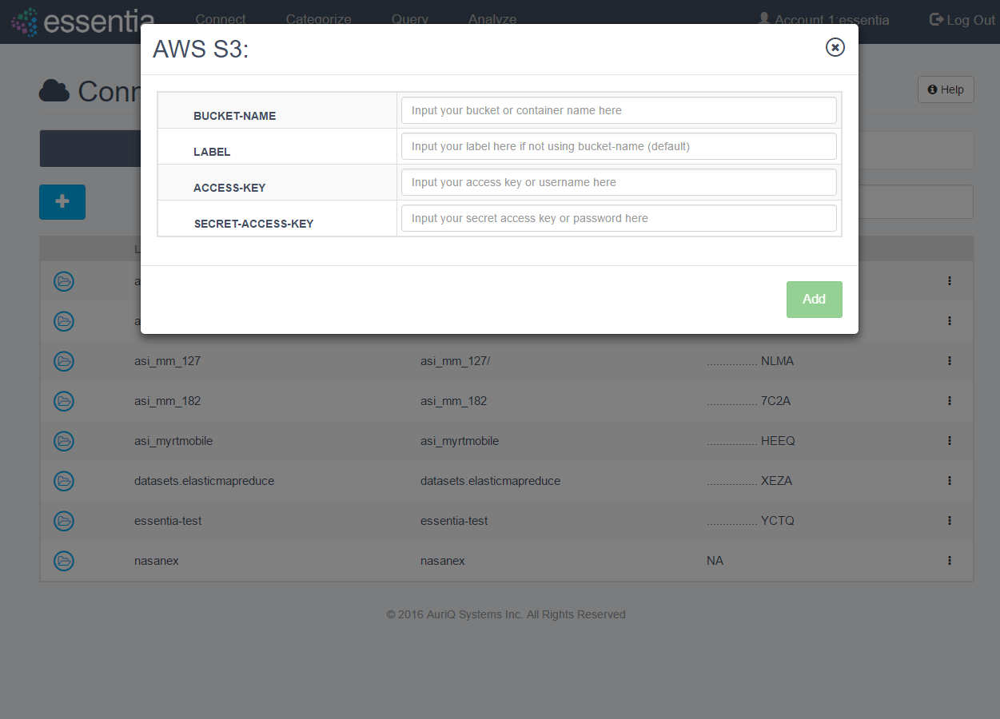
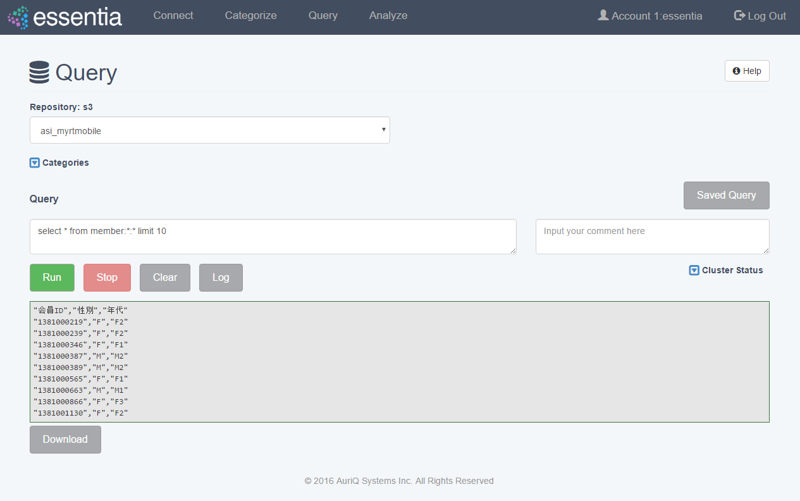
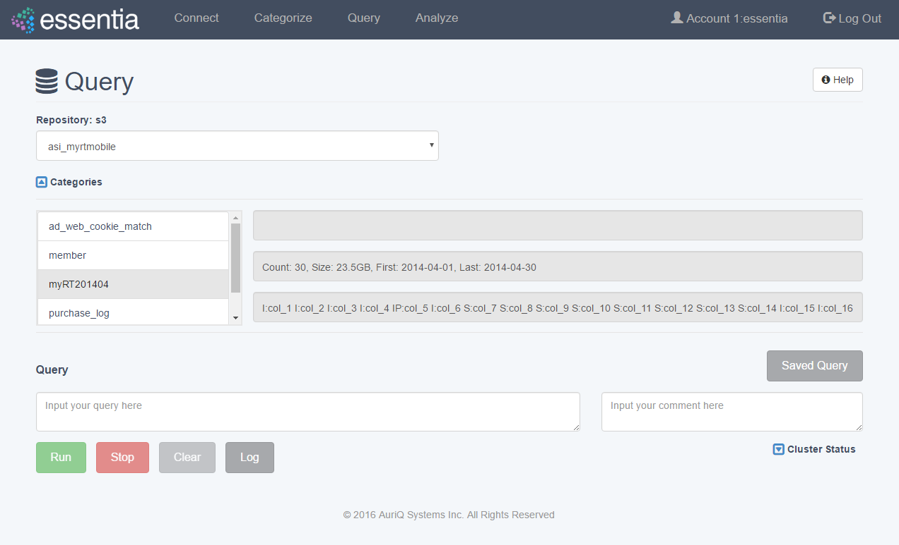
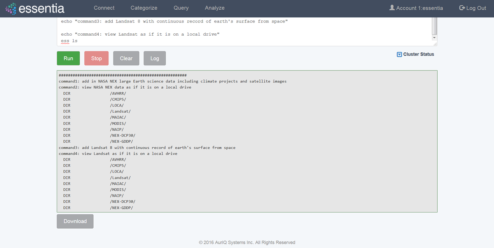

***************
Getting Started
***************

*This guide will help walk you through the basic setup and use of the Essentia Data Lake Manager.*

To learn more about how to create a category, see :doc:`../reference/manuals/category-rules`.

Repository setup and management
--------------------------------

.. `Video Demo <https://www.youtube.com/watch?v=G5x4dDazFug&width=640&height=480>`_

`Video Demo <https://youtu.be/ZTMmD_cICm0>`_

**Link to AWS S3**

1. Click on **Connect** in the top menu and then the AWS S3 tab.
2. Click on the **+** icon to open the input form.
3. Enter your AWS S3 credentials (bucket name, access key, secret access key) and a label if you prefer to call the bucket by another name.

**Note:** If you are running the AWS Marketplace version of Essentia, you do not need to enter your AWS credentials. Instead, setup an IAM role as described in :doc:`../install/aws/iam-role`.

4. Click on the **Add** button to add your S3 repository.
5. Your newly added repository will be displayed in the AWS S3 table.

**Link to Azure Blob**

1. Click on **Connect** in the top menu and then the Azure Blob tab.
2. Click on the **+** icon to open the input form.
3. Enter your Azure Blob credentials (container name, username, password) and a label if you prefer to call the container by another name.
4. Click on the **Add** button to add your Blob repository.
5. Your newly added repository will be displayed in the Azure Blob table.

**Explore Your Data Repository**

To explore your new repository or any repository that you've already connected to, follow the steps in `Exploring Your Data Repository`_.

**Remove Repository**

1. Click on **Connect** in the top menu.
2. Choose the appropriate tab (AWS S3 or Azure Blob).
3. Click the icon on the right of the table for the repository you want to remove.
4. Select the Remove (trash) icon.
5. Confirm to delete your setting.

.. image:: ../screenshots/connect_delete.png
   :align: center
   :scale: 10
   :target: ../screenshots/connect_delete.png
   
Exploring Your Data Repository
-------------------------------

..  in the **Connect** tab of the UI or click **Explore** in the **Categorize** tab of the UI.

1. Click the folder icon next to your respository in the **Connect** or **Categorize** tabs of the UI. A new tab will open, allowing you to explore your Data Repository.
2. In the new tab, click the **+** next to a directory to navigate through the directories on your Repository.
3. Your current path is displayed at the top, under your repository name. This is useful when defining a pattern for the files you want to group into a category. You can click the blue icon to the right of the displayed path to copy that path to your clipboard.
4. You can click the icon next to any filename to **Download** or **Delete** that file from your Repository. You can also click the icon and then **Preview file content** to view an uncompressed sample of the raw data in the file.

.. image:: ../screenshots/categorize_explore_dwnld.png
   :align: center
   :scale: 10
   :target: ../screenshots/categorize_explore_dwnld.png

|
| *Note:* If the Explorer tab does not open, you may need to enable pop-ups from the Essentia UI.

You can click the **Search** icon to look for files matching a globular pattern within the current path on your Repository.

*Note:* For a more detailed description of globular matching patterns, see `Glob (programming) <http://en.wikipedia.org/wiki/Glob_%28programming%29>`_

You can click the **Download** icon to choose files or folders to download from the current path on your Repository.

You can click the **Upload** icon to choose files to upload to the current path on your Repository.

You can click the **Folder** icon to create a new folder in the current path on your Repository.

You can click the **Information** icon to calculate the total number of files and bytes in the current path on your Repository.

You can click the **Refresh** icon to get the latest list of files on your Repository.

.. *Note:* If the Explorer tab does not open when you click **Explore**, you may need to enable pop-ups from the Essentia UI.

Datastore category setup and management
---------------------------------------

`Video Demo 1 <https://youtu.be/GtgMjGkI-bA>`_

`Video Demo 2 <https://youtu.be/KUpEfQ9mBL4>`_

**Create category**

1. Click on **Categorize** in the top menu and select a Repository from the drop down.
2. Click on the **+** icon to open the input form.
3. Define your Category by entering:

* `Category Name <../reference/manuals/category-rules.html#category-name>`_ - any arbitrary name (no spaces).
* `Pattern <../reference/manuals/category-rules.html#pattern>`_ - globular matching pattern(s) to describe what types of files to include in your category.

4. Optionally define any number of the following options to speed up data scanning or make data management easier:

* `Comment <../reference/manuals/category-rules.html#comment>`_ - any arbitrary comment.
* `Exclude <../reference/manuals/category-rules.html#exclude>`_ - globular matching pattern to describe what files to not include in your category. **Note:** this further restricts the files included by your ``Pattern``.
* `Use cached file list <../reference/manuals/category-rules.html#use-cached-file-list>`_ - reference the local file list for the current category instead of accessing the repository.

.. image:: ../screenshots/categorize_options.png
   :align: center
   :scale: 10
   :target: ../screenshots/categorize_options.png

5. Or click on the **Advanced Options** drop down arrow to display additional category options and define either or both of the following options:

* `Date Format <../reference/manuals/category-rules.html#date-regex>`_ - matching date extraction pattern found in filename structure. Specify a regular expression pattern to extract the date from your file path/name, see `Date Regex <../reference/manuals/category-rules.html#date-regex>`_.
* `Delimiter <../reference/manuals/category-rules.html#delimiter>`_ - the type of delimiter (comma, space, tab, etc) used in your data.
 
6. Click on the **Save** button to create your category. This may take a few minutes while Essentia scans your data.
7. After the scan is complete, the derived column specifications will be displayed along with metadata about your files. Also, you can now choose to do any of the following:

   * **Define a Preprocess Command**
   * **Select a Pattern for Internal Files within Archive Files**
   * **Directly Edit Column Specification**

8. Your newly added category will be displayed in the category table for the selected repository. From here you can edit, copy, scan, or delete a category, view a sample of the data or see the list of files that make up your category.

**Define a Preprocess Command**

1. Follow steps 1-6 of creating a category.
2. Click on the **Advanced Options** drop down and enter a Preprocess Command next to **Preprocess**. You can then **Check** or save this command to preprocess your data:

* `Preprocess <../reference/manuals/category-rules.html#preprocess>`_ - command to modify your raw data before it is scanned by Essentia.

.. 3. If your category contains zip files, you canOr click on the options drop down arrow to display category options and define either of the following options:

**Select a Pattern for Internal Files within Archive Files**

1. Follow steps 1-6 of creating a category.
2. Click on the **Advanced Options** drop down and enter a pattern next to **Archive**.

* `Archive <../reference/manuals/category-rules.html#archive>`_ - matching pattern to describe filenames within a compressed or uncompressed archive file.

.. * `Compression <../reference/manuals/category-rules.html#compression>`_ - drop down to select the type of file compression

**Directly Edit Column Specification**

1. Follow steps 1-6 of creating a category.
2. Choose the table or text display icon on the far right of **Column Spec Details** to display the determined Column Specifcation in your chosen format.
3. From here, you can change `column headers <../reference/manuals/category-rules.html#column-headers>`_ (no spaces) and assign `data types <../reference/manuals/category-rules.html#data-types>`_ in case the scan was not correct.
4. Click on the **Save** button to save your changes.

.. In the main **Categorize** tab of the UI you can also click the download or upload symbol to the right of the search box 
.. to read in or save all of your categories for a single Repository from or to an Essentia settings file. 
.. This makes sharing your categories with other people easy and makes your work easily transferable between computers.

In the main **Categorize** tab of the UI you can also click the *download symbol* to the right of the search box
to save all of your categories for a single Repository to an Essentia settings file. 
Similarly, you can click the *upload symbol* to the right of the search box
to read in all of your categories for a single Repository from an Essentia settings file.
This makes sharing your categories with other people easy and makes your work easily transferable between computers.

.. caution::

   Uploading an Essentia settings file for a data repository to your instance will overwrite any existing categories you have defined for that repository. 

If new files have been uploaded to your repository recently, you should click **Refresh** to update all of the summary information shown for your categories in the **Categorize** tab of the UI. 
Whenever you use a category for analysis, however, that category always refreshes itself to ensure that your analysis uses the most accurate view of the files in your Repository. 
The **Refresh** button in the **Categorize** tab is only needed to update the displayed summary information.

By clicking the number in the *File Count* column of your category, you can view a graph displaying the **Daily Trend of File Count**. 
You can also click the number in the *Total Size* column to view a graph showing the **Daily Trend of File Size** for that category. 
These graphs can be very useful in tracking the day-to-day changes to your category. 
In particular, File Size is an important metric since as the File Size increases for a category, your analyses using that category may require instances with more resources (cpu, memory, disk space, ...). 

By clicking the icon in the right-most column of the category table, you can access additional options to gain information about or manage each category:

* **List Files:** View a list of the files currently matched by your category pattern.
* **Sample:** View a sample of the raw data in the category.
* **Scan:** Run a deep scan of the category to determine detailed information such as type and number of unique elements for each column in that category's data.
* **Download Files:** Save up to 1GB of files from your category onto your local computer.
* **Copy:** Create a new category from your existing category. The new category will need to be named and will use the same file pattern and column specification as the original category by default.
* **Export:** Save your category defintion for your Repository to an Essentia settings file. This file can then be shared with others or imported to other computers you use to load your category definition.
* **Remove:** Remove your category definition. This step cannot be undone!

Query setup and management
-----------------------------

`Video Demo <https://youtu.be/UgaUPX07lBY>`_

**Create a Query**

1. Click on **Query** in the top menu and and select a Repository from the drop down
2. Enter your SQL like query in the **Input your query here** area. You can optionally enter a comment for this query so you can reference it later. 
3. Click on the **Run** button to view your query results on your screen and then optionally download your query results into a file on your computer by clicking **Download** and entering a filename.
4. If you do not need the results of your query anymore, you can click **Clear** to delete those results. 
5. From this point you can access a **Saved Query** or run a new query. Running another query will clear the previous query's results.

   
.. , or generate an OData link for easy loading into Tableau by clicking **OData**.

| 
You can view the last 1000 lines of the essentia log file (where debug information, warnings, and errors are written) by clicking **Log**. This can be useful to determine how you can improve your query.

You can click **Cluster Status** to view status information and resource usage of each of the computers in your cluster. If you are running in local mode on a single computer, you will only see the information for that computer. 

.. By clicking **Saved Query** you can access 

*Note:* If you need to view available categories, click on the **Categories** drop down arrow to view a list of available categories.

   
`Query Format <../dlv/direct-query-examples.html>`_ ::

    select [column_name] | [*] from [category_name]:[start_date | *]:[end_date | *] where ... order by ... limit ...

    select count(distinct [column_name] | [*]) from [category_name]:[start_date | *]:[end_date | *]  where ...

    select [column_name], count(*) from [category_name]:[start_date | *]:[end_date | *]  where ... group by [column_name]
    
`Rules <../dlv/direct-query-examples.html>`_ ::

    The first query format above is a "select" query.
    The second and third query formats above are "count" queries.
    
    1. Group By is NOT supported for SELECT queries. 
    2. Order By is NOT supported for COUNT queries.
    3. Limit is NOT supported for COUNT queries.
    4. Group By can only be used when there is no DISTINCT in COUNT queries.
    
`Example <../dlv/direct-query-examples.html>`_ ::

    select * from myfavoritedata:*:* where payment >= 50
    select * from purchase:2014-09-01:2014-09-15 where articleID>=46 limit 10
    
To see more examples of the types of queries we allow and work with some sample queries of our public data, please go through our :doc:`./direct-query-examples`

.. **Transfer Data with Tableau OData**
.. 
.. 1. Create a query following the steps above and click the **OData** button to generate an OData link to your query.
.. 2. Copy this Link using the **Copy** option on the right of the URL box or highlight the URL and copy it to your clipboard.
.. 3. Open Tableau and go to the "To a server" connection section.
.. 4. Select **OData**. Note, you need to click "More Servers" to see the OData option if you are using Tableau Desktop.
.. 5. Paste the URL into the box after "Server:" and select **No Authentication** (this should be the default).
.. 
.. | *Note:* 
.. |   Our OData service is still in its Beta version and is currently limited to sending 10,000 lines of data (and 100,000 values) *into* Tableau. However, you can *query* larger amounts of data as long as the *output* is less than 10,000 lines (and 100,000 values). This will be improved in the full version, which will be released in the near future, along with support for OData clients other than Tableau.

**Working with Saved Queries**

1. Select your Saved Query from the dropdown after clicking the **Saved Query** button. The query should appear in the *"Input your query here"* area. If you labeled your query, the label should appear in the box under the Saved Query button.
2. Now you can click the **Run** button to view your query results on your screen and then optionally download your query results into a file on your computer by clicking **Download** and entering a filename.

.. 2. Now you can click the **Run** button to view your query results on your screen, download your query results into a file on your instance by clicking **Download** and entering a filename, access the query via an http link by clicking **HTTP**, or generate an OData link for easy loading into Tableau by clicking **OData**.
.. You can generate a new HTTP link for your query by clicking **HTTP** and then clicking **Reset**. This is useful if you want to share the link with others, but only want to provide them access for a limited amount of time. 

You can search your saved queries by clicking on the **Saved Query** button and entering any parts of your desired queries or labels into the *"Search for ..."* box. 

Script setup and management
-----------------------------

.. `Video Demo <https://youtu.be/jILkSbnPHeg>`_

**Run a Script**

1. Click on **Analyze** in the top menu.
2. Select a Github Repository from the drop down menu or use the Default (DirectScipt - auriq).
3. Enter your Essentia or unix shell commands in the **Input your script here** area. You can optionally select one of the files from your Github Repository to edit or run. To do this, click the file icon to the left of the filename. 
4. Click on the **Run** button to view your script's results on your screen.

.. image:: ../screenshots/analyze_script.png
   :align: center
   :scale: 10
   :target: ../screenshots/analyze_script.png
   
*Note:* You can also **Stop** running your script or, when it has finished, **Download** the result onto your local machine or **Clear** the results so they are no longer stored. You must terminate any worker cluster before running **Clear** or you will have to terminate those nodes manually (without Essentia).

You can view the last 1000 lines of the essentia log file (where debug information, warnings, and errors are written) by clicking **Log**. This can be useful to determine how you can improve your scripts.
   
*Note:* You can also view the status of your master computer and any other machines you are utilizing by clicking on **Cluster Status**. This will show you the connection information and resource usage of each connected machine.

**Connect to a Github Repository**

1. Click on **Analyze** in the top menu.
2. Click the **+** button.
3. Enter the **Owner** of your Github Repository, the name of your **Repository**, and your Personal Access **Token**. If you do not have a Personal Access Token, follow the instructions found `here <https://help.github.com/articles/creating-an-access-token-for-command-line-use/>`_.
4. Click on the **Save** button to finish adding your Github Repository.
5. From this point you can view, edit, and run any of the scripts stored in the Github Repository. 

.. To commit any changes back to you Github Repository, the Personal Access Token you used to connect to the repository must have had write permissions. If this is the case, you can click **Commit** to push your changes back onto the Github Repository.

*Note:* To view or switch between available Github Repositories or Branches, click on the **Github Repository** or **Branch** drop down menus.

Questions
---------

Our tutorials are intended to guide you through the usage of the included tools, but you should feel free to contact us at essentia@auriq.com with any other questions.
