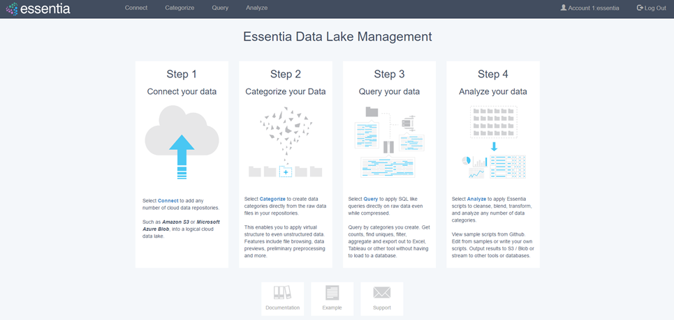

*********************
Data Lake Manager GUI
*********************

| 
Your Essentia instance provides a **web-based UI** which we call the 'Data Lake Manager'.  This service allows users to
quickly examine and categorize the files within their cloud based data stores.  It also allows SQL style queries 
as well as running command line scripts on raw data so that quick inspections and analysis of data can be 
performed without the need of first moving data into another analysis platform.

.. toctree::
   :maxdepth: 2

   dlv
   ../reference/manuals/category-rules
   direct-query-examples
   using-rstudio
   
.. direct-script-examples
