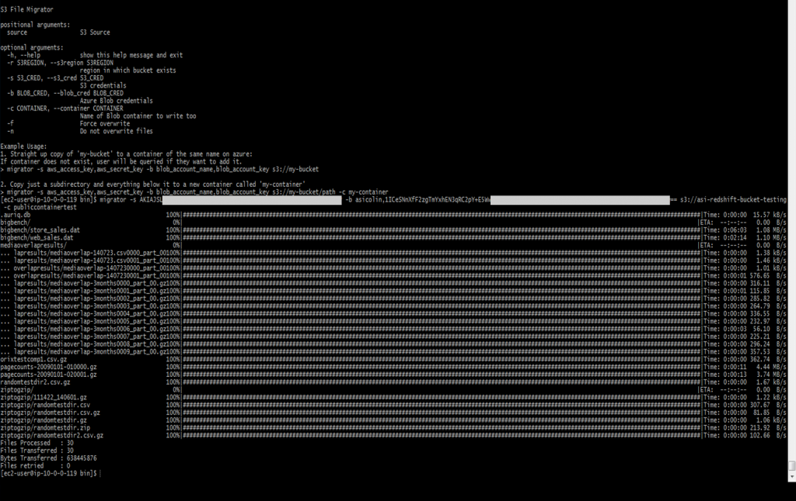

*****************************
File Migration
*****************************

Overview
=========

The Essentia File Migration tool is a simple script that can be called from the command line.
It allows the easy and efficient transfer of files from AWS S3 to Azure Blob storage using an Azure VM.

.. note::

    Access to the command line is possible via a SSH connection.  Typically the format is ``ssh username@host`` where the username
    and host are the same as that chosen in the VM creation blade.

The migrator only requires the name of the S3 bucket to copy files from and your access credentials to that bucket and Azure Blob. 
By default it copies all of the files in the S3 bucket into an Azure container of the same name, creating such an Azure container if one does not already exist.

Running on the Command Line
===========================

In order to use the migration tool you must be in the ``/usr/local/bin`` directory (or simply replace ``migrator`` below with ``/usr/local/bin/migrator``).

You can then copy the entire contents of your s3 bucket into an Azure container with the same name by running ::

    migrator -s aws_access_key,aws_secret_key -b azure_account_name,azure_account_key s3://your_bucket
    
Here ``-s`` allows you to specify your AWS S3 access key and secret access key and ``-b`` allows you to enter your azure account name and account key.
    
Instead of copying an entire bucket you may only want to copy some of the files along a certain path of that bucket over to an Azure container. 
The following command demonstrates how you can copy only files in ``your_bucket/a_folder`` that do not already exist in the Azure container ``existing_container`` into that Azure container by utilyzing the ``-n`` and ``-c`` flags::

    migrator -n -s aws_access_key,aws_secret_key -b azure_account_name,azure_account_key s3://your_bucket/a_folder -c existing_container

The ``-n`` flag told migrator not to overwrite any existing files and ``-c`` told it to look for existing files and copy new files into the Azure container ``existing_container``.

