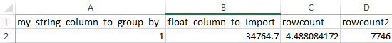

Introduction To Essentia
=========================

This tutorial will get you started processing simple data stored on your local machine.

1. You will first be given the full set of processing commands used in our example ETL Essentia file.

2. We will then show you step-by-step how to take 10000 rows of example data containing a single column of numeric values and import them into Essentia, apply a filter to narrow down the desired values, return their sum and average, and export these metrics to a csv file.

The Processing Commands in Our Example Essentia File 
----------------------------------------------------

::

    ess spec drop database etl-ess2working
    ess spec create database etl-ess2working --ports=1
    ess spec create vector vector1 s,pkey:my_string_column_to_group_by f,+add:float_column_to_import f,+last:rowcount f,+last:rowcount2

    ess udbd start            # Starts communication with worker nodes (or master by default if running a local instance). Starts the database so you can import data into it.

    ess task stream mockdata "*" "*" "aq_pp -f,+1,eok - -d s:column_to_import -evlc f:float_column_to_import '(ToF(column_to_import))' -filt '(float_column_to_import >= 1 && float_column_to_import <= 8)' -evlc s:my_string_column_to_group_by 'ToS(1)' -evlc f:rowcount '\$RowNum' -ddef -udb_imp etl-ess2working:vector1" --debug

    ess task exec "aq_udb -exp etl-ess2working:vector1 -pp vector1 -pp_evlc rowcount2 'rowcount' -pp_evlc rowcount 'float_column_to_import / rowcount' > /home/user/etl-ess2working.csv; aq_udb -cnt etl-ess2working:vector1" --debug

Approach
--------

These processing commands import one string column as an integer and then filter, aggregate, average, and export it. They contain the following key steps:

1. Define a database and what you want to store in it.

2. Start udbd so data can be stored in the database you just created.

3. Import the tutorial data from its category into your database using ``ess task stream category startdate enddate`` .

4. Export the modified and aggregated data from the database and save it to a file.

Step One: Databases
-------------------

Initial Setup
^^^^^^^^^^^^^^^^^^^^^^^^^^^^^^^^^^^^^^^^^^^^^

First we need to define the database we want to use.

* Make sure that there are no existing databases with the same name, etl-ess2working

``ess spec drop database etl-ess2working``

* And then create the database and give it a port to communicate over

``ess spec create database etl-ess2working --ports=1``

* Now we need to define the vector we want to store the data in and tell Essentia which columns and attributes we want the vector to have

``ess spec create vector vector1 s,pkey:my_string_column_to_group_by f,+add:float_column_to_import f,+last:rowcount f,+last:rowcount2``
 

Every database requires one column in each table or vector definition to be a hashable string type labeled with the attribute **s,pkey**. The hash tells Essentia to group the results by the unique values of the corresponding string column.

In this case the results are grouped by an artificial column with only one value. This way, the attributes we provide to the columns in this vector are applied to ALL of the rows in the data.

The attributes we use are ``+add`` to sum the float_column_to_import values and ``+last`` to take the row number that is last imported (i.e. the number of rows in the data). These columns will be explained in detail shortly and you can find a description of the supported attributes below.

Databases: Supported Attributes 
^^^^^^^^^^^^^^^^^^^^^^^^^^^^^^^^^^^^^^^^^^^^^

Tables and Vectors allow certain attributes to be used upon merging rows during import. They are::

    column_type, pkey #primary hash key, must be string type
    column_type, tkey #integer sorting key
    column_type, +key #string key to merge on
    column_type, +first #Use the first imported value when merging
    column_type, +last #Use the last imported values when merging
    column_type, +add #Sum values across rows for each unique value
    column_type, +bor #Bitwise-OR numeric values
    column_type, +min #Take the smallest value
    column_type, +max #Take the largest value
    column_type, +nozero #Ignore values of 0 or an empty string

Step Two: Starting the Essentia Database
----------------------------------------------------

This is a very simple but critical step. Run

``ess udbd start``

This starts Essentia's database, allowing you to import data into it so the attributes you defined in your vectors and tables can be applied.

Step Three: The Import Step
----------------------------------------------------

Column Types
^^^^^^^^^^^^^^^^^^^^^^^^^^^^^^^^^^^^^^^^^^^^^

The columns you define are also typed.

* While importing data you must put something for every column; however, unwanted columns can simply be marked by an **X**. Any column you want to keep needs to have the format ``column_type:column_name``.

* The tutorialdata.txt has one column of strings named column_to_import and has no other columns. Thus you need **s:column_to_import**  where ``s`` stands for string.

Other common column types are ``i`` (integer) and ``f`` (floating point). For a full list of supported types, see the documentation.

Processing Your Data
^^^^^^^^^^^^^^^^^^^^^^^^^^^^^^^^^^^^^^^^^^^^^

So how do you process the data?

There are two main tools you use for Essentia:

    **aq_pp**

    **aq_udb**

* ``aq_pp`` is the primary tool used when you're working with data. It is mainly used to import data, modify some of the input data's columns or create new ones, and to import the modified data into the table in the database.

* ``aq_udb`` is primarily used to export data from your table in the database into a file or wherever else you want it. During export, the existing columns can be modified further by applying **-pp**, **-pp_filt**, and **-pp_evlc** before saving the result to a file.

The Import Step: Options
^^^^^^^^^^^^^^^^^^^^^^^^^^^^^^^^^^^^^^^^^^^^^^^

When using ``aq_pp``, there are a number of keywords you can place in the various options. Each is described in detail in the aq_pp Documentation, therefore I will focus on the most commonly used keywords, including:

* **-f**
* **-d**
* **-evlc**
* **-filt**
* **-grep**
* **-if -endif statements**
* **-ddef**
 
-----------------------------------------------

| ``-f``                 
|    tells Essentia and aq_pp that you want to reference a file to find your data. If the file is defined earlier in your essentia file then you follow the ``-f`` with a ``-``.

| ``-d``                
|    tells Essentia that you are going to define the columns of the input file.

| ``-evlc``    
|    is most used to create a new column or to modify an existing column according to an expression. It has the syntax:
|    ``-evlc column_type:column_name 'Expression_to_evaluate'``

| ``-filt``     
|    goes row by row through the dataset and determines whether the row meets the condition specified. If it does, then the row is passed on. If not, the row is thrown out. It has the syntax:
|    ``-filt '(condition)'``

| ``-grep``     
|    matches each row against a lookup table of values to compare against. If the row has a value that is also in the lookup table then the row is passed on. If not the row is thrown out. The syntax is:
|    ``-grep column_name lookup_table_file_name``

| ``-if -elif -else -endif statements``              
|    can be used to take action or evaluate an expression if a condition evaluates to true for each row. They can be combined with the other keywords such as **-evlc** and **-filt** to create more complex expressions. Their basic syntax is:
|    ``-if condition 'expression' -else 'alternate_expression' -endif``

| ``-ddef``
|     identifies any columns that are defined in the configuration file but not in the current data set and sets their value to zero or an empty string. This is very useful to import data into a table or vector that you want to add data to later. The syntax is:
|     ``-ddef``

--------------------------------------------

| ``-udb_imp``         
|     is the main keyword used for the export option. It is used to reference the database you are using for your data and to import the data into the table you defined in that database. It has the syntax:
|     ``-udb_imp databasename:tablename``

Thus this is used to tell Essentia and ``aq_pp`` to take the data it has imported and modifications it has made, and to import that modified data into the table in the database according to the column definitions specified for that table in the same database. This imported data is stored in memory to minimize input/output time.

Putting it Together
^^^^^^^^^^^^^^^^^^^^^^^^^^^^^^^^^^^^^^^^^^^^^

We can now complete the first task definition by adding::

    ess task stream mockdata "*" "*" "aq_pp -f,+1,eok - -d s:column_to_import -evlc f:float_column_to_import '(ToF(column_to_import))' -filt '(float_column_to_import >= 1 && float_column_to_import <= 8)' -evlc s:my_string_column_to_group_by 'ToS(1)' -evlc f:rowcount '\$RowNum' -ddef -udb_imp etl-ess2working:vector1" --debug 

.. 

The part in quotes is the command we want to run and ``ess task stream mockdata "*" "*"``  just tells essentia to take all files from category mockdata and pipe them into essentia's ``aq_pp`` command. The **--debug** option tells essentia to print the command if there is an error.

Wait, what did we do? 
^^^^^^^^^^^^^^^^^^^^^^^^^^^^^^^^^^^^^^^^^^^^^

Here's a step by step explanation of the command we just created:

| ``-f`` 
|     tells essentia to use the tool aq_pp to pre-process a file (our tutorial data).

| ``+1`` **and** ``eok`` 
|     skip the first line of the file and tells ``aq_pp`` that errors are ok and should be allowed.

| ``-`` 
|     tells ``aq_pp`` that the file is defined in the datastore section and will come from stdin.

| ``-d``
|     says we're going to define the columns of the data set and specifying **s:column_to_import**  sets that definition.

| ``-evlc f:float_column_to_import '(ToF(column_to_import))' -filt '(float_column_to_import >= 1 && float_column_to_import <= 8)' -evlc s:my_string_column_to_group_by 'ToS(1)' -evlc f:rowcount '\$RowNum' -ddef``
|     is the filter command and will be explained shortly.

| ``-udb_imp etl-ess2working:vector1``  
|     tells ``aq_pp`` to look at the database etl-ess2working for a table or vector to import the data into and tells it to import the data into vector1.

Now I'll explain the filter command in detail.

Understanding our Filter
^^^^^^^^^^^^^^^^^^^^^^^^^^^^^^^^^^^^^^^^^^^^^

| ``-evlc f:float_column_to_import '(ToF(column_to_import))'``   
|     takes our column_to_import and converts it to a float using the **ToF()** function, and then creates a new float column called float_column_to_import that contains those converted values.

| ``-filt '(float_column_to_import >= 1 && float_column_to_import <= 8)'``  
|     applies a filter that checks row-by-row whether the value in float_column_to_import is greater than or equal to 1 AND less then or equal to 8. If the condition is True then the record is kept, if not the record is thrown out and wont be used for any subsequent operations.

| ``-evlc s:my_string_column_to_group_by 'ToS(1)'``  
|     uses **ToS()** to convert the numeric value 1 to a string value '1' and then creates a new column of strings that are all set to the value '1'.

| ``-evlc f:rowcount '\$RowNum'``  
|     uses the variable **$RowNum** (this is built into essentia) to create a new column of floats called rowcount that keeps track of which row the current information is in (The \ is needed to escape the $ symbol in bash).

| ``-ddef``  
|     sets all undefined columns that are present in the database to 0 or an empty string. In this case it is temporarily setting each entry in the rowcount2 column to zero (we will see this definition and its use shortly).

Congrats on finishing your first essentia task definition!

Step Four: Exporting
----------------------------------------------------

We still have one more task definition to write so that we can export our results and apply some final operations.

* This one uses the ``aq_udb`` tool since we want to export data FROM the database.
* It then tells ``aq_udb`` which database and vector to export the data from using the -exp command.
* We then use **-pp** to tell ``aq_udb`` we want to operate on the exported vector and we use **-pp_evlc** to modify two of the existing columns before we save the results to a csv file.

``ess task exec "aq_udb -exp etl-ess2working:vector1 -pp vector1 -pp_evlc rowcount2 'rowcount' -pp_evlc rowcount 'float_userid / rowcount' > /home/user/etl-ess2working.csv; aq_udb -cnt etl-ess2working:vector1" --debug``

The part in quotes is the task we want to run and ``ess task exec`` just tells essentia to execute that task. The **--debug** option tells essentia to print the command if there is an error.

Results
----------------------------------------------------

You should now have the following results stored in a file called

etl-ess2working.csv

Picture1

|resultscsv| 

.. including the results csv picture

The columns are:

A: An arbitrary value to group by

B: The sum of all the values in the original imported column that passed the filter

C: The average of all of those values

D: The total number of values used in these calculations (i.e. the number of values that passed the filter)

The Full Essentia File
----------------------------------------------------

This is the full Essentia File including the beginning instance and datastore categorization steps. The processing steps (lines 13+) should now make more sense. Please play around with this script or check out our other tutorials.

::

    ess instance local      # Starts a local instance since no workers are needed. Tells essentia to work on your machine.
    ess udbd stop            # Checks that the nothing in stored in memory from previous essentia runs.
    
    ess datastore select s3://asi-public --aws_access_key=*YourAccessKey* --aws_secret_access_key=*YourSecretAccessKey*
    #ess datastore select $HOME/samples/data-for-local-installation   ### Use this if you downloaded the local installation of essentia.
    #ess datastore purge   ### only use if you want to delete any existing categories before proceeding. Not needed here.
    ess datastore scan
    
    ess datastore rule add "*MOCK_DATA*" "mockdata"
    ess datastore probe mockdata --apply
    ess datastore summary
    
    ess spec drop database etl-ess2working
    ess spec create database etl-ess2working --ports=1
    ess spec create vector vector1 s,pkey:my_string_column_to_group_by f,+add:float_column_to_import f,+last:rowcount f,+last:rowcount2
    
    ess udbd start            # Starts communication with worker nodes (or master by default if running a local instance). Starts the database so you can import data into it.
    
    ess task stream mockdata "*" "*" "aq_pp -f,+1,eok - -d s:column_to_import -evlc f:float_column_to_import '(ToF(column_to_import))' -filt '(float_column_to_import >= 1 && float_column_to_import <= 8)' -evlc s:my_string_column_to_group_by 'ToS(1)' -evlc f:rowcount '\$RowNum' -ddef -udb_imp etl-ess2working:vector1" --debug
    
    ess task exec "aq_udb -exp etl-ess2working:vector1 -pp vector1 -pp_evlc rowcount2 'rowcount' -pp_evlc rowcount 'float_column_to_import / rowcount' > /home/user/etl-ess2working.csv; aq_udb -cnt etl-ess2working:vector1" --debug

The Full Approach
----------------------------------------------------

The full example essentia file should be approached in the following steps:

1. Tell essentia to run on your local machine and make sure the udbd database is not already running.

2. Pick the bucket containing the tutorial data and scan it for files. If you are using the local installation, pick the directory that contains the sample data and scan it for files.

3. Organize the tutorial data into its own category and have essentia examine it to determine its column specification and delimiter.

4. Define a database and what you want to store in it.

5. Start udbd so data can be stored in the database you just created.

6. Import the tutorial data from its category into your database using ``ess task stream category startdate enddate``.

7. Export the modified and aggregated data from the database and save it to a file.

As you can see, we left out the instance and datastore steps (1, 2, and 3). Below is a brief description of how to work with datastores. For a full description, see Manage Your S3 Bucket.

Datastores
----------------------------------------------------

For this tutorial the data is stored on the publicly available bucket asi-public or is included in the local installation. Any authenticated AWS user has list permission on the bucket so you can access the data by selecting the asi-public bucket and entering your access keys (if you're using AWS) or selecting the directory that contains the sample data files (if you're using the local installation). 

* Thus we want to select the datastore:

``ess datastore select s3://asi-public --aws_access_key=*YourAccessKey* --aws_secret_access_key=*YourSecretAccessKey*
#ess datastore select $HOME/samples/data-for-local-installation   ### Use this if you downloaded the local installation of essentia.``

* And scan it for files

``ess datastore scan``

* We then put the tutorial data into a category called mockdata by looking for files with filenames that have MOCK_DATA in them.

``ess datastore rule add "*MOCK_DATA" "mockdata"``

* Then we probe the datastore to find information about the tutorial files such as their columns specs, compression, and delimiter; and save these values so essentia doesn't have to repeat this step next time it uses this datastore.

``ess datastore probe mockdata --apply``

* Finally we output a summary of the existing categories in our bucket.

``ess datastore summary``

 