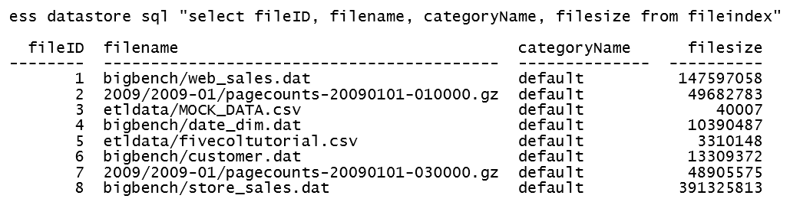
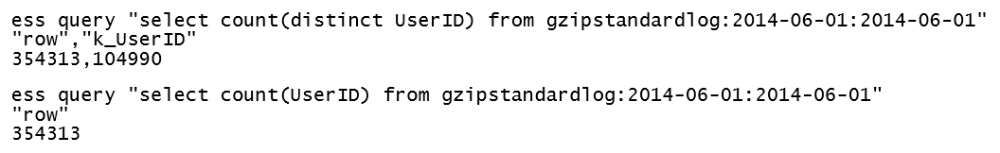

SQL Query
=========

Once you've scanned your files you can use Essentia's **SQL Indexing** feature to find out more information about them.
With SQL Indexing its easy to determine and aggregate filesizes and counts so you can ensure that the categories you
create contain the files you intended them to. 

This adds an extra layer of security to help prevent you from
unnecessarily processing excess files. It also makes it easy to compute metrics such as average filesize or the range
in filesizes so you can have a better idea of how much data you are processing and catch any extraordinarily large
files.

--------------------------------------------------------------------------------
    
Now that you've categorized your files and gotten an idea of the number and type of files in each category you can
analyze your data using simple **SQL-like statements**. The "like" is simply because you must use the category name and
start and end dates of your data instead of the traditional s3://bucket/path notation in the 'from' part of your SQL
statement. 

Thus you are able to select a small amount of data (say a few files from each category) and run whatever
SQL analysis and statistics you want on it. For example, it's extremely easy to count the number of unique siteID's
or unique users in a marketing log or countryID in other types of logs. This allows you to get quick access to and
results from your data without having to load everything into a database table.

