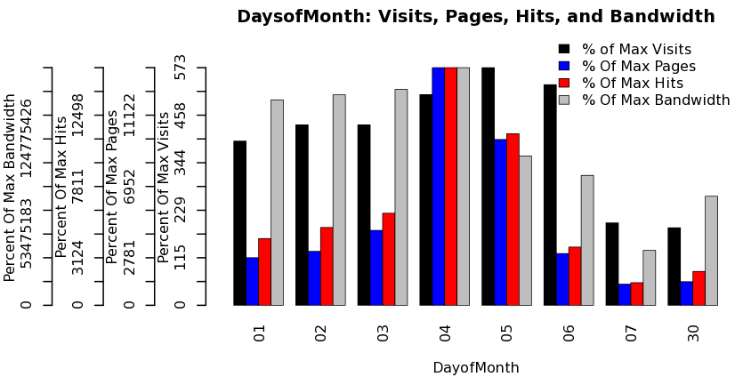
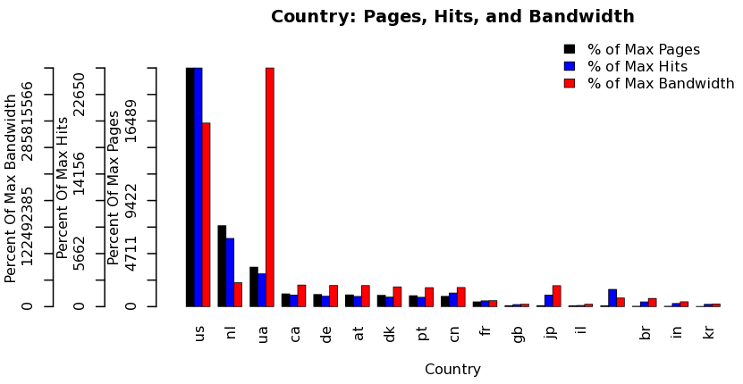

Apache Log Analysis
===================
Easy Integration with Existing Tools for Advanced Analytics

**Analyze any Apache Log**

* Essentia utilizes a log converter that can take any log format and turn it into a format that is readable by the essentia preprocessor. It only requires one, easy step to specify which format the log is in and then the setup is complete. 
* Essentia's powerful scanner means that you can take any number or combination of your apache logs and run your analysis on them, all in a matter of lines.

**Stream into R for Advanced Analysis:**

* A single integration script runs the essentia code across however many instances you use and captures the output as R data frames.
* You are then free to run whatever analysis you desire in R, utilizing its vast library of statistical and graphical packages. Its easy to analyze and visualize apache logs by whatever segmentation your logs allow. 
* Counting unique visitors, visits, pages, hits, and bandwidth are just some of the analytics you can accomplish across any size data by using essentia.

**Analysis Within Your Reach:**

* Essentia is preset to analyze the combined or extended apache log format and is easily adapted to additional formats.
* We provide counts by Hour, Day, Month, Country, OS, Browser, Referrer URL, Search Phrase, HTTP Error Code, and Duration of Visit.
* Get started with Essentia and gain valuable insights today. 

If you have R installed, you can run our Apache Log Analysis Demo by changing into the Rintegration/ folder included in the local install or on the ami and then running::

    R          # and then
    source("runr.R")
    
If you dont have R installed and want to see our demo or integration in action, check out `Getting Started with the R Integrator <http://vm146.auriq.net/documentation/source/usecases/getting-started-with-the-r-integrator.html>`_.